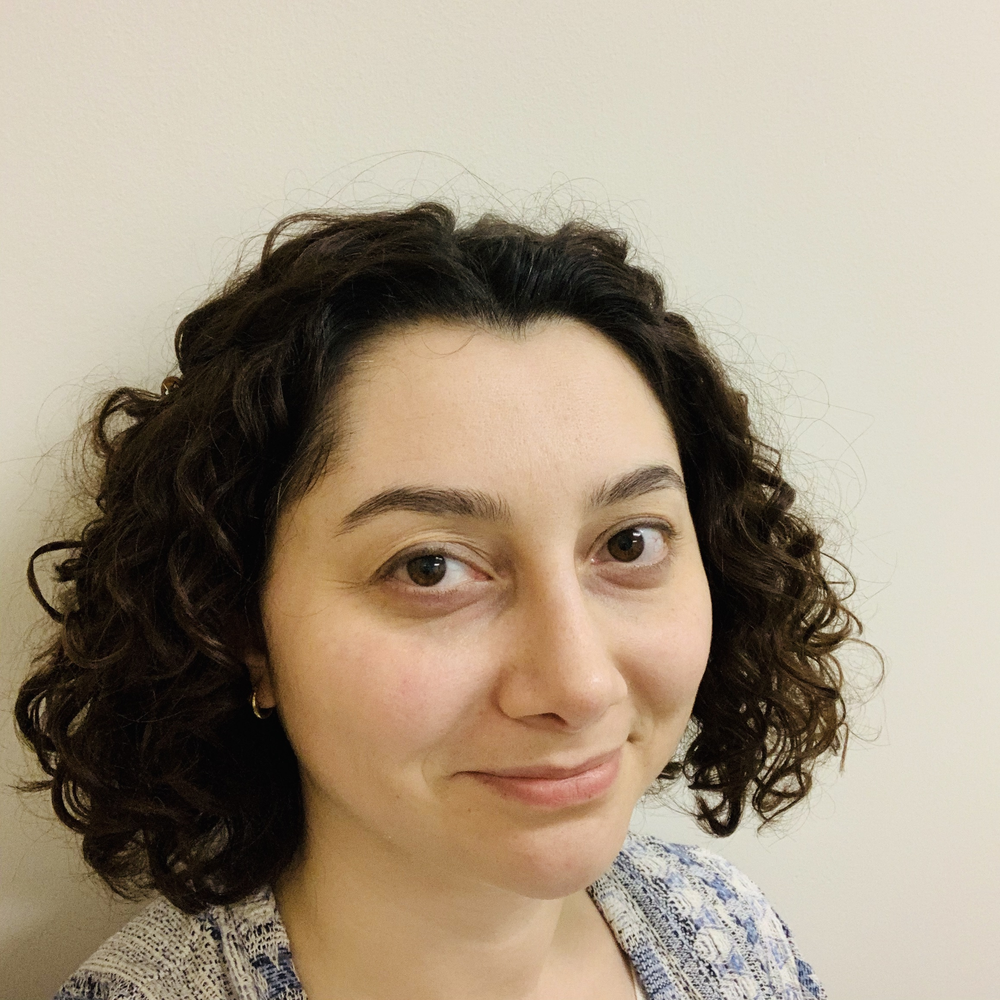

---
---

<link rel="stylesheet" href="styles.css" type="text/css">



```{r, echo=FALSE}
library(emojifont)
library(blogdown)
library(emo)
```

<br> </br>
Hello,
<br> </br>
I'm a PhD candidate in Physics at Concordia University. I work on molecular modelling of membrane proteins -- yes, I am one of those physicists who are supposed to show you a movie of a protein jiggling in the middle of their talk. I love computational biochemistry/biophysics, coding (especially with R and Python!), teaching & learning and talking about any of these topics!   
<br> </br>

I graduated from the [Koc University](https://eng.ku.edu.tr/en/academics/interdisciplinary-graduate-programs/computational-sciences-and-engineering/) with a MS in Computational Sciences and Engineering in 2014. Same year, I started my PhD in Physics at [Concordia University](http://www.concordia.ca/artsci/physics.html), where I am working on molecular modelling of ion channels and trasporters under the supervision of [Dr. Guillaume Lamoureux](http://lamoureuxlab.org/people.html) at Rutgers University–Camden. I expect to graduate this year.
<br> </br>

My full CV is available [here](files/tnozturkcv.pdf).
<br> </br>

A quick note about my website: I have built this website using the amazing tutorial by [Emily C. Zabor](http://www.emilyzabor.com/tutorials/rmarkdown_websites_tutorial.html) `r emo::ji("heart")`. I like generating documents (tutorials, presentations, websites) with R. I also like the fact that there is an R package called tinytex -- I think it's cute.